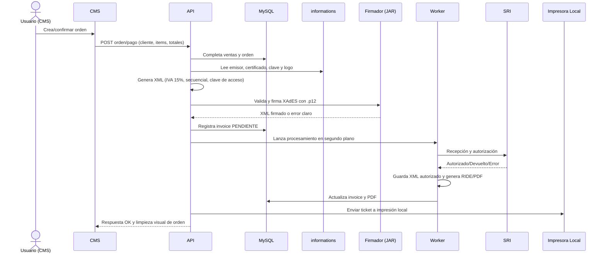

# Arquitectura del Proyecto POS

Este documento describe la arquitectura lógica del sistema POS (PHP 8, MySQL, OpenSSL), sus componentes, interacciones y decisiones clave observadas a partir del repositorio y del historial de commits.

---

## 1) Visión general

**Capas principales**:

- **Presentación (CMS)** — carpeta `cms/`: UI de administración, panel de órdenes, caja, métricas, catálogos.
- **Aplicación (API)** — carpeta `api/`: lógica de negocio y endpoints (ventas, productos, clientes, impresión, SRI).
- **Datos (BD)** — **MySQL**: persistencia de productos, órdenes, usuarios/admins, sucursales, clientes, configuración del emisor y facturas.
- **Integraciones**: 
  - **Impresión local** (tickets)
  - **Códigos QR** (`lib/phpqrcode/`)
  - **SRI**: generación de XML, firma XAdES (JAR/ejecutable), autorización, RIDE/PDF y correo.

```
[CMS] <——HTTP——> [API] <——> [MySQL]
   │                     │
   ├——— QR (lib)         ├——— SRI (Firma/Autorización)
   ├——— RIDE/PDF         └——— Impresora Local
   └——— certificados/ (.p12 fuera del docroot)
```

---

## 2) Componentes y responsabilidades

- **CMS (`cms/`)**  
  - Renderiza vistas del panel: Ordenes, Caja, Productos, Clientes, Reportes.  
  - Control de acceso y filtrado por **sucursal** del administrador.  
  - Dispara acciones hacia la API (ventas, cierres, impresión, facturación).

- **API (`api/`)**  
  - **Orders**: CRUD de órdenes, totales, métodos de pago, descuentos, cálculo de unitarios.  
  - **Products/Categories**: filtrado por sucursal, búsqueda por código de barras, top ventas.  
  - **Caja**: validaciones de apertura/cierre (no permitir cierre con $0.00; asegurar fecha final registrada).  
  - **Secuencial**: obtiene el **próximo número** para comprobantes/ventas.  
  - **XML/SRI**: generación de XML con IVA **15%**, firma, autorización, worker en segundo plano y actualización de `invoices`.  
  - **Impresión**: cambio a estrategia **local** (reducción de dependencias remotas).  
  - **Correo**: notificaciones (mejoras de envío y manejo de errores).

- **Librerías**  
  - **phpqrcode (`lib/phpqrcode/`)**: generación de códigos QR.  
  - **OpenSSL**/**cURL**: cifrado y llamadas externas (firma/autorizar, impresión).
  - **SecretController (`cms/controllers/secret.controller.php`)**: cifrado reversible de secretos operativos como la clave del certificado `.p12`.
  - **GeneratePDFfromXML (`cms/GeneratePDFfromXML/`)**: generación del RIDE/PDF desde XML autorizado y datos del emisor.

---

## 3) Flujos críticos

### 3.1 Venta + Facturación electrónica (EC)



### 3.2 Impresión local de tickets

- Sustituye la anterior impresión remota.  
- La API invoca un **endpoint/servicio local** que comunica con el spooler del OS o un microservicio de impresión.  
- Beneficios: **menos latencia**, **menos puntos de fallo**, soporte offline local.

---

## 4) Modelo de datos (alto nivel)

> El detalle exacto depende del esquema concreto. A nivel lógico, se esperan tablas como:

- `products`, `categories`, `product_prices`
- `orders`, `order_items`, `payments`
- `clients` (clientes), `users` (admins), `offices` (sucursales), `user_office`
- `informations` (datos del emisor, logo, certificado `.p12` y clave cifrada)
- `invoices` (clave de acceso, estado SRI, PDF generado)
- `sequential` / `documents`
- `logs`, `email_queue`, `print_queue`

**Claves**:  
- Relación **orden ↔ items** (1:N)  
- **Admin ↔ sucursal** (N:1) para filtrar alcance  
- **Secuencial** con control transaccional para evitar colisiones

---

## 5) Decisiones y consideraciones técnicas

- **Compatibilidad**: base PHP 8.1/OpenSSL 3; desarrollo actual en macOS con PHP 8.1.34, MySQL Homebrew y PHP built-in server. Laragon/MySQL 5.7 quedan como referencia histórica del entorno original.
- **Impuestos**: cambio a **IVA 15%** en 2025 (ajuste en generación de XML).  
- **Fechas**: validación de **nuevo formato** (evitar ceros) para cumplir SRI.  
- **Seguridad**: control por **sucursal**; sanitización de entradas en endpoints; evitar exponer rutas de firma.  
- **Certificados**: los `.p12` se suben desde el CMS pero se guardan fuera del docroot en `pos/certificados/`; `cms/certificados/` queda solo como compatibilidad de archivos antiguos.  
- **Secretos**: `password_certification_information` se cifra de forma reversible con `app_key`; las contraseñas de usuarios siguen usando hash irreversible.  
- **RIDE/PDF**: el logo se obtiene desde `informations`, no desde archivos locales fijos ni desde `infoAdicional` del XML.  
- **Observabilidad**: logging de salida al firmar y autorizar, manejo de errores y depuración en la API.  
- **Rendimiento**: impresión local para minimizar latencia; consultas filtradas por sucursal; índices en tablas de alto uso.

---

## 6) Entornos

### Desarrollo (Laragon - Original)
- Apache en puerto 80 con vhosts (`cms.pos.com`, `api.pos.com`)
- php.ini con `curl` y `openssl` habilitados
- Permisos en `temp/` para archivos generados

### Desarrollo (macOS - Actual)
- **PHP Built-in Servers** en dos instancias:
  - CMS: `php -S 0.0.0.0:8000` (desde carpeta `cms/`)
  - API: `php -S 0.0.0.0:8001` (desde carpeta `api/`)
- **MySQL 9.7.1** instalado con Homebrew (`brew services start mysql`)
- **Dominios virtuales** en `/etc/hosts`:
  ```
  127.0.0.1 cms.pos.com
  127.0.0.1 api.pos.com
  ```
- **Comunicación CMS↔API** a través de `127.0.0.1:8001` (no `api.pos.com`)

#### Cambios Mínimos para macOS
| Archivo | Cambio | Razón |
|---------|--------|-------|
| `curl.controller.php` | `http://127.0.0.1:8001/` | Evitar deadlock (servidor se llamaría a sí mismo) |
| `install.controller.php` | `CREATE TABLE IF NOT EXISTS` | Permitir reintentos de instalación |
| `template.php` | Validar `$adminTable != null` | Prevenir warnings en PHP 8.1 |
| `.gitignore` | Agregar `.DS_Store`, `certificados/*` | Ignorar archivos de sistema macOS y certificados |

**Credenciales DB (igual en ambos):**
```
Usuario: root
Contraseña: root
BD: u590035688_pos2
```

### Producción
- ✅ Credenciales de BD y token API separadas a variables de entorno (`.env`, ver `CLAUDE.md`); pendiente solo definir valores reales de producción y rotar el token actual
- Certificados (.p12) en directorio protegido (no en git)
- `cms/config/facturacion.config.php` fuera del repo; usar `app_key` o `POS_APP_KEY`
- Nginx/Apache como proxy en puerto 80/443
- PHP-FPM para mejor gestión de procesos
- MySQL con replicación o managed service
- Logs rotados y backups automatizados

---

## 7) Roadmap sugerido

- Endpoint de **healthcheck** para API/firmador/impresora.  
- ~~**Bloqueo transaccional** (o `GET FOR UPDATE`) en generación de secuencial.~~ ✅ Ya implementado (`SecuencialModel::obtenerProximoNumero`, `FOR UPDATE` + transacción).
- **PRs** de hardening: ✅ credenciales/token a `.env`, ✅ queries con interpolación directa parametrizadas con PDO — pendiente: CSRF en CMS, cabezales de seguridad.
- **Tests** básicos (PHPUnit o Pest) para lógica crítica: impuestos, secuencial, totales.
- Migrar `vendor/` de los 3 subproyectos (`api`, `cms/mail`, `cms/extensions`) a `composer install` documentado en el README en vez de versionarlos en el repo (ya sacados del tracking de git; cada uno tiene su propio `composer.json`).
