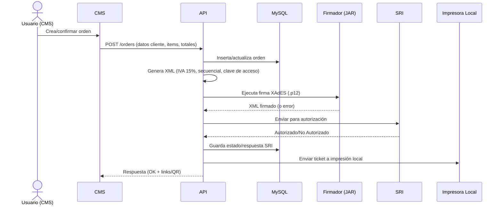

# Arquitectura del Proyecto POS

Este documento describe la arquitectura lógica del sistema POS (PHP 8, MySQL, OpenSSL), sus componentes, interacciones y decisiones clave observadas a partir del repositorio y del historial de commits.

---

## 1) Visión general

**Capas principales**:

- **Presentación (CMS)** — carpeta `cms/`: UI de administración, panel de órdenes, caja, métricas, catálogos.
- **Aplicación (API)** — carpeta `api/`: lógica de negocio y endpoints (ventas, productos, clientes, impresión, SRI).
- **Datos (BD)** — **MySQL 5.7**: persistencia de productos, órdenes, usuarios/admins, sucursales, clientes, etc.
- **Integraciones**: 
  - **Impresión local** (tickets)
  - **Códigos QR** (`lib/phpqrcode/`)
  - **SRI**: generación de XML, firma XAdES (JAR/ejecutable) y autorización.

```
[CMS] <——HTTP——> [API] <——> [MySQL]
   │                     │
   ├——— QR (lib)         └——— SRI (Firma/Autorización) + Impresora Local
```

---

## 2) Componentes y responsabilidades

- **CMS (`cms/`)**  
  - Renderiza vistas del panel: Ordenes, Caja, Productos, Clientes, Reportes.  
  - Control de acceso y filtrado por **sucursal** del administrador.  
  - Dispara acciones hacia la API (ventas, cierres, impresión, facturación).

- **API (`api/`)**  
  - **Orders**: CRUD de órdenes, totales, métodos de pago, descuentos, cálculo de unitarios.  
  - **Products/Categories**: filtrado por sucursal, búsqueda por código de barras, top ventas.  
  - **Caja**: validaciones de apertura/cierre (no permitir cierre con $0.00; asegurar fecha final registrada).  
  - **Secuencial**: obtiene el **próximo número** para comprobantes/ventas.  
  - **XML/SRI**: generación de XML con IVA **15%**, firma y autorización.  
  - **Impresión**: cambio a estrategia **local** (reducción de dependencias remotas).  
  - **Correo**: notificaciones (mejoras de envío y manejo de errores).

- **Librerías**  
  - **phpqrcode (`lib/phpqrcode/`)**: generación de códigos QR.  
  - **OpenSSL**/**cURL**: cifrado y llamadas externas (firma/autorizar, impresión).

---

## 3) Flujos críticos

### 3.1 Venta + Facturación electrónica (EC)



### 3.2 Impresión local de tickets

- Sustituye la anterior impresión remota.  
- La API invoca un **endpoint/servicio local** que comunica con el spooler del OS o un microservicio de impresión.  
- Beneficios: **menos latencia**, **menos puntos de fallo**, soporte offline local.

---

## 4) Modelo de datos (alto nivel)

> El detalle exacto depende del esquema concreto. A nivel lógico, se esperan tablas como:

- `products`, `categories`, `product_prices`
- `orders`, `order_items`, `payments`
- `clients` (clientes), `users` (admins), `offices` (sucursales), `user_office`
- `sequential` / `documents`
- `logs`, `email_queue`, `print_queue`

**Claves**:  
- Relación **orden ↔ items** (1:N)  
- **Admin ↔ sucursal** (N:1) para filtrar alcance  
- **Secuencial** con control transaccional para evitar colisiones

---

## 5) Decisiones y consideraciones técnicas

- **Compatibilidad**: actualizaciones para **PHP 8.1.30**, **OpenSSL 3.1.7**, **MySQL 5.7.39**, Laragon dev.
- **Impuestos**: cambio a **IVA 15%** en 2025 (ajuste en generación de XML).  
- **Fechas**: validación de **nuevo formato** (evitar ceros) para cumplir SRI.  
- **Seguridad**: control por **sucursal**; sanitización de entradas en endpoints; evitar exponer rutas de firma.  
- **Observabilidad**: logging de salida al firmar y autorizar, manejo de errores y depuración en la API.  
- **Rendimiento**: impresión local para minimizar latencia; consultas filtradas por sucursal; índices en tablas de alto uso.

---

## 6) Entornos

- **Desarrollo (Laragon)**: vhosts, php.ini con `curl` y `openssl` habilitados, permisos en `temp/`.  
- **Producción**: separación de credenciales, certificados (.p12) y rutas de firmado; logs rotados; backups de BD.

---

## 7) Roadmap sugerido

- Endpoint de **healthcheck** para API/firmador/impresora.  
- **Bloqueo transaccional** (o `GET FOR UPDATE`) en generación de secuencial.  
- **PRs** de hardening: sanitización centralizada, CSRF en CMS, cabezales de seguridad.  
- **Tests** básicos (PHPUnit o Pest) para lógica crítica: impuestos, secuencial, totales.